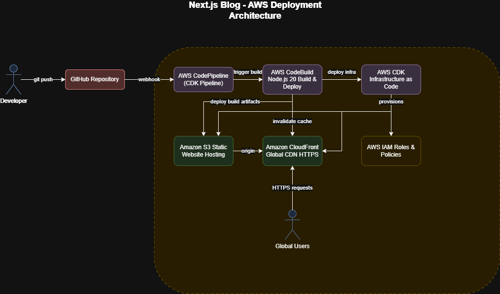

# Next.js Blog Starter - AWS Deployment

A statically generated blog using Next.js, Markdown, and TypeScript, deployed to AWS.

**Live Demo:** [https://d2d4nyf8x6q72s.cloudfront.net](https://d2d4nyf8x6q72s.cloudfront.net)

## AWS Deployment Strategy

**Architecture Diagram:**



[View on draw.io](https://app.diagrams.net/?tags=%7B%7D&lightbox=1&highlight=0000ff&edit=_blank&layers=1&nav=1&title=aws-architecture-diagram.drawio&dark=auto#R%3Cmxfile%3E%3Cdiagram%20name%3D%22AWS-Architecture%22%20id%3D%22aws-nextjs-blog%22%3E7Vxbd5s4EP41Pmf3ITkyN5NHX9q028vmbNJt%2B7RHgGzUYsSCiO3%2B%2BpWMMDfFIQQwzuYhNhqEkL5vNJqRxhmp8%2FX2OoSB%2B4k4yBspwNmO1MVIURRgGOyLS3aJZDwGaiJZhdgRskxwi38hIQRCGmMHRYWKlBCP4qAotInvI5sWZDAMyaZYbUm84lsDuEIVwa0Nvar0K3aomw7DuMpuvEN45YpXm8okubGGaWUxksiFDtnkROqbkToPCaHJ1Xo7Rx5HL8Ulee7tA3cPHQuRT%2Bs8QDFlg6o8JNqJ6C4dMkVbdm%2Fm0rXHBGN2GdGQ%2FERz4pGQSXzis5qzJfa8kgh6eOWzos1aR0w%2Bu0chxQzMqbixxo7DXzPbuJii2wDa%2FJ0bpjtMFpLYdxDvLeDNE58KdRibaVl0kvcp6fY99GLR7c%2Bs25c%2FIiaceWTFvi7Y3%2FTrLftcoMAjuzUfMxOFNn%2B5TeNQwMF7ibY5OASA14isEQ13rIqbo1gVhG4yfVAnQiZa0YAo74qPQKGNq0PLGWHsQnAm589B98gjAcO1BodM2QJ%2BGa%2B9qU1JnouP0ELeDYkwxYRzYhFKyVpCFiVBUQ1ITD3sMz1IpxooqcFIUR2IzKVd0Rl2x7BNZC1lzC2KI3siHYaEjiIbZpGMsa4%2Fn40Vpm5s1aEiU%2BvxA4qfg7iE5tK0kS1F0zJ1TQcyNK8xfcd7Bv5CAWeZiIE9FVetiutYKQKrlNR8bLSALNxEF7ZHYqdzcJdLRQ6uY1iGbrA7DozcQ%2Bu8cAMps2x8drCRAl2GfyOwdVBFewKKaKtlPVZasCoba%2FrnB6zf%2FfHFhgD88%2BPvu6l6IXBGTmVtrHJB4tAWtWy2%2FAc4QNxIVJjijaX2m4TUJSviQ%2B9NJi3Z%2F6zOR8IN0Z6CH4jSnVgVYExJkV%2FhHsBwhUQnI1VKT5WLEHmQ4vvicJ%2BDaxWL7hQZjR0dTWSKfGVMVGjItDRZGOeslzeHXoLf5osP7CuV%2FN5QlR%2B1G5pSthstaDJH3Iqx17ndeB7cs6SL4DO7TtwVDgZIxSPFgOtg34RwW9paFMskGGXj3caymE647tBn2JuOJkPfVCzVkKO%2Fhr%2BYr6OAW5V%2FUDbVbXbxFVlsfeSK%2F45EFPurrqAu67sK2tB3vkYuQ8Kd2gFDPufdfJt0E1x7xIJ8EPPFZw773d3NbV%2F63Q7ozs8Bm5e99X7vL0PIno1FhMPHm5ierpA2u7AkGK67RrqGA%2FgA0u%2Bnn7iDTTwUlWz2DfGwjbm4H6xb0eo4QmFUB%2B2zCisPxuZLNrzWY0tD0wt8aHoLfOw3rho64aVtglN74Pk4OccNE%2FOhxJErJ6F1f3wPqdIM0vwYTo1nNa7IobpBlkvIzz4hVZtBejRU7Ai2XHCQw4yGeLXiswUc7tfE7rDaPQylaOmG4L37k1Yhy2WEaAXrwwvrw681hz8Hx8mVOvWqcrw4IvgBmPszZ0aL0YyWNHo6OR%2Bl0CJHC2HTBft9WpjJGap4Yd%2FwSfhinxWwA%2FdhqQ1tF%2FWJtdkQ63T%2BDgrlQwSRg9cOEYM26hPTq2aY5nzyAZsDEcEz6P6NUUT7Ala6a62YDwP7erpZN%2BQ50emmnNGrOoyeVVB6jmedUm7S974efrZ5%2BCmH%2BsiK8XoUWuCmfewb7hnIG9NOsaCjLabf%2BOOXuih9z91ZbEXL%2B8JOFKpOgHxAupTzZ3gA%2B0enYQh3uQoBD9TyvkUauaWbcEZRHVKj%2BPaB%2Bpp5tD67SHrQNAaUYqUXM9WglaqAxJAeVcWS9uzXuCLj9T2VEEX4l%2BgK510gzRrXZyN9IZvUh8BcRFcAsraX0Kb1t1il2iAeuQCXAIzVAj8XjylMR7G8nIbOjzhfz%2FMftaBDBf9ln%2B4fXQMGev78ko785fgbg8b%2FZZ3%2FSxnQGm6byemcSFf5rn1EnwHxLV%2F4nnmMvJi5ifvSU%2F1E4xRuoVl2C%2FXjbuHkmfXVXtxI8HKUDVxO9IK%2BPaJth59QPDlEGbrq6eOj9btRpZT9QTpTLymXSY5%2Bre3q1%2Fymzvyml7e5fL4ZT3K%2Fqs2lLj1LOPVh2tHN9FNmSMkpaJiFdnSUw6Sg%2BlORftOp5Pi3uv1cTS%2FpDV2tgu7ZJl7JiWqYCDegc4K6VE4qVJ5rrpacyYY5dUc3x4bJpFFhstf0Ljn8%2Bv9mIlXhf1b2l%2FDPwKVypT0Wz%2FY6oRpmQw5ox6Iuo2aF0SAk9zhiAcJTUqOyozBDmwyKyobJmEcDsGFSWZ2c%2FeS6sWL2P0ES3rJ%2FraK%2B%2BQ8%3D%3C%2Fdiagram%3E%3C%2Fmxfile%3E)

### How the Pipeline Deploys This Application

This deployment is **fully automated** - the CDK pipeline handles all infrastructure provisioning and application deployment without manual intervention.

**Infrastructure Deployment (Automated):**
- CDK pipeline creates S3 bucket with static website hosting
- Configures bucket policy for public read access
- Provisions CloudFront distribution with S3 origin
- Sets up custom error pages and caching policies
- Enables HTTPS with default CloudFront certificate
- Creates IAM roles with least-privilege permissions

**Application Deployment (Automated):**
- Pipeline triggers on Git push to main branch
- CDK synthesizes and deploys infrastructure changes
- CodeBuild builds Next.js application
- Syncs static files to S3 bucket
- Invalidates CloudFront cache for immediate updates

### Components
- **Amazon S3**: Static file hosting with website configuration
- **Amazon CloudFront**: Global CDN with edge caching and HTTPS
- **AWS CodePipeline**: CI/CD orchestration with GitHub integration
- **AWS CodeBuild**: Automated build environment with Node.js runtime
- **AWS CDK**: Infrastructure as Code for automated provisioning

**Next.js Configuration:**
- Static export enabled via `output: 'export'` in next.config.js
- Trailing slashes and unoptimized images for static hosting
- Build generates static files to /out directory

## Build Pipeline Details

### Pipeline Architecture

**Source Stage:**
- **Tool**: AWS CodePipeline with GitHub integration
- **Trigger**: Webhook on push to main branch
- **Action**: Downloads source code and passes to build stage

**Build Stage:**
- **Tool**: AWS CodeBuild
- **Runtime**: Amazon Linux 2, Node.js 18
- **Build Commands**:
  ```bash
  # Install dependencies with clean install
  npm ci
  
  # Build Next.js application (includes static export)
  npm run build
  ```
- **Artifacts**: Static files in /out directory

**Deploy Stage:**
- **Tool**: AWS CodeBuild Step in CDK Pipeline
- **Actions**:
  1. Sync /out directory to S3 bucket (`aws s3 sync out/ s3://$BUCKET_NAME --delete`)
  2. Invalidate CloudFront cache (`aws cloudfront create-invalidation --distribution-id $DISTRIBUTION_ID --paths "/*"`)
  3. Environment variables passed from CDK stack outputs

### Build Tools & Configuration

**AWS CDK Pipeline:**
- **Environment**: `LinuxBuildImage.STANDARD_7_0`
- **Compute**: `ComputeType.SMALL`
- **Runtime**: Node.js 20, .NET 8.0
- **Infrastructure as Code**: C# CDK constructs

**GitHub Integration:**
- **Source**: GitHub repository with AWS Secrets Manager token
- **Trigger**: Push to main branch
- **Pipeline**: CDK Pipelines with self-mutating capability

**Deployment Automation:**
- **S3 Sync**: `aws s3 sync out/ s3://$BUCKET_NAME --delete`
- **Cache Invalidation**: `aws cloudfront create-invalidation --distribution-id $DISTRIBUTION_ID --paths "/*"`
- **IAM Permissions**: Scoped S3 and CloudFront permissions via CDK

### Why This Architecture?
- **Cost-effective**: Pay only for storage and data transfer
- **Scalable**: CloudFront handles global traffic spikes
- **Fast**: Edge locations serve content closest to users
- **Reliable**: 99.99% SLA with managed AWS services
